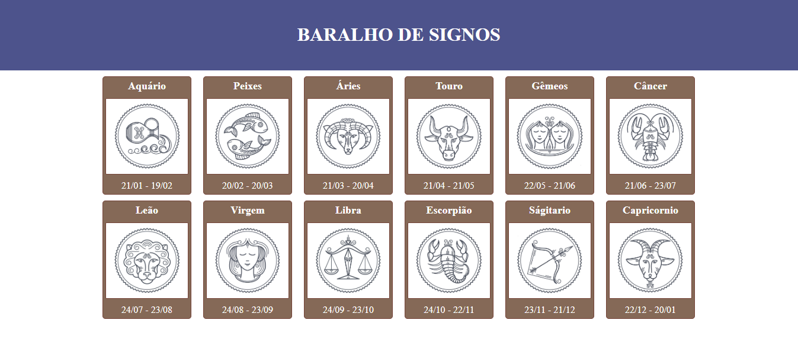
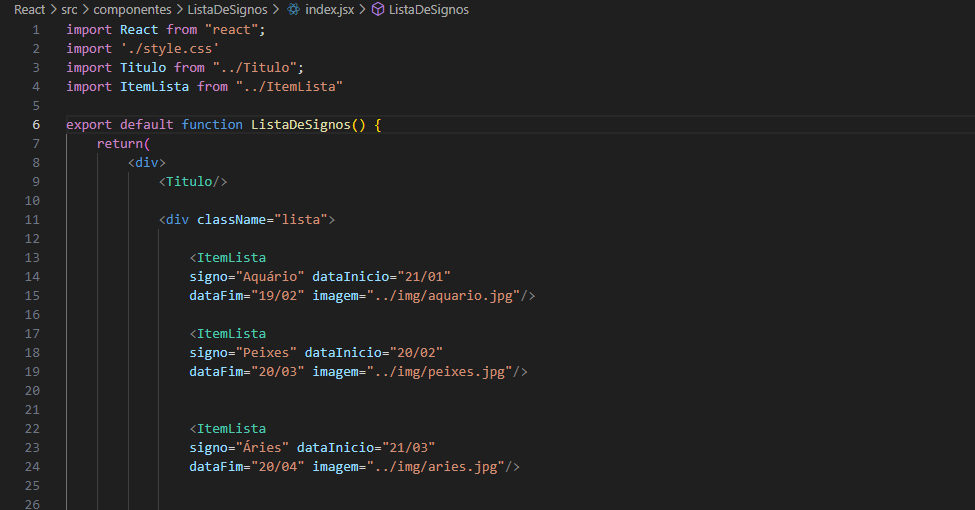
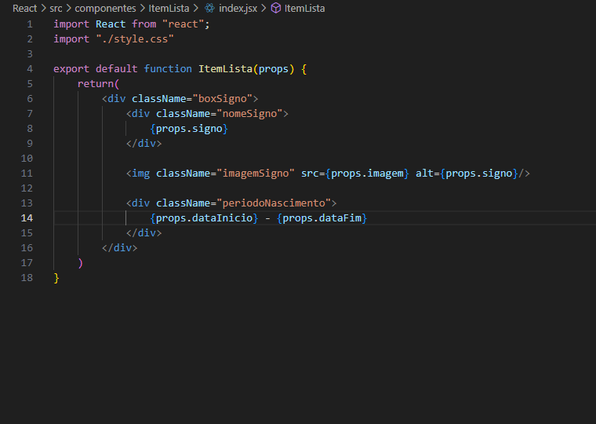

# Cards de Signos.

## Tecnologia: 

## Objetivo:
### - Criar uma pagina Web, utilizando Props: (São valores "parâmetros" que passamos para um componente).

## Oque aprendi:
### - Através do Props, consegui aproveitar diversos componentes.
### - E também um novo conceito com React js, para utilizar em projetos futuros.

## 
## 
### Aqui mostro um pouco a definição do código, na linha 13 eu defini o componente ItemLista, e dentro dele paravras chave como signo, data inicio, data fim e imagem. Isso foi feito para cada card, e na imagem abaixo.
## 
### Na função ItemLista(props), eu chamo através do props a palavra chave que esta no componente ItemLista, exemplo: {props.signo}, {props.imagem}. E através disso ele busca estas informações no outro componente.
